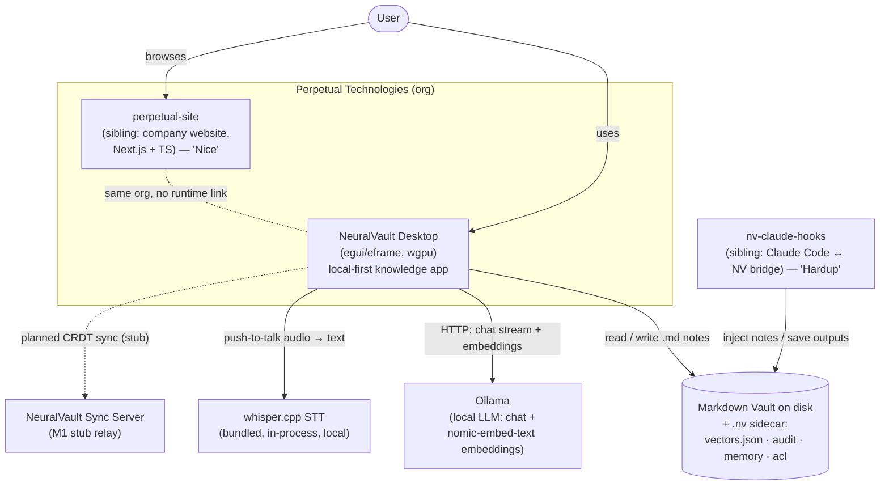
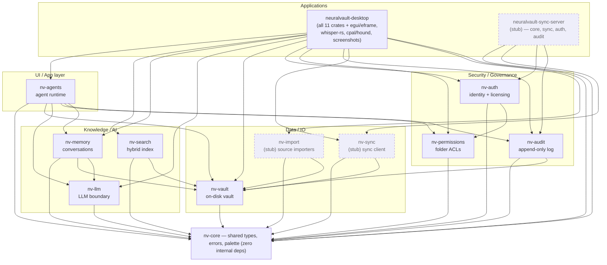
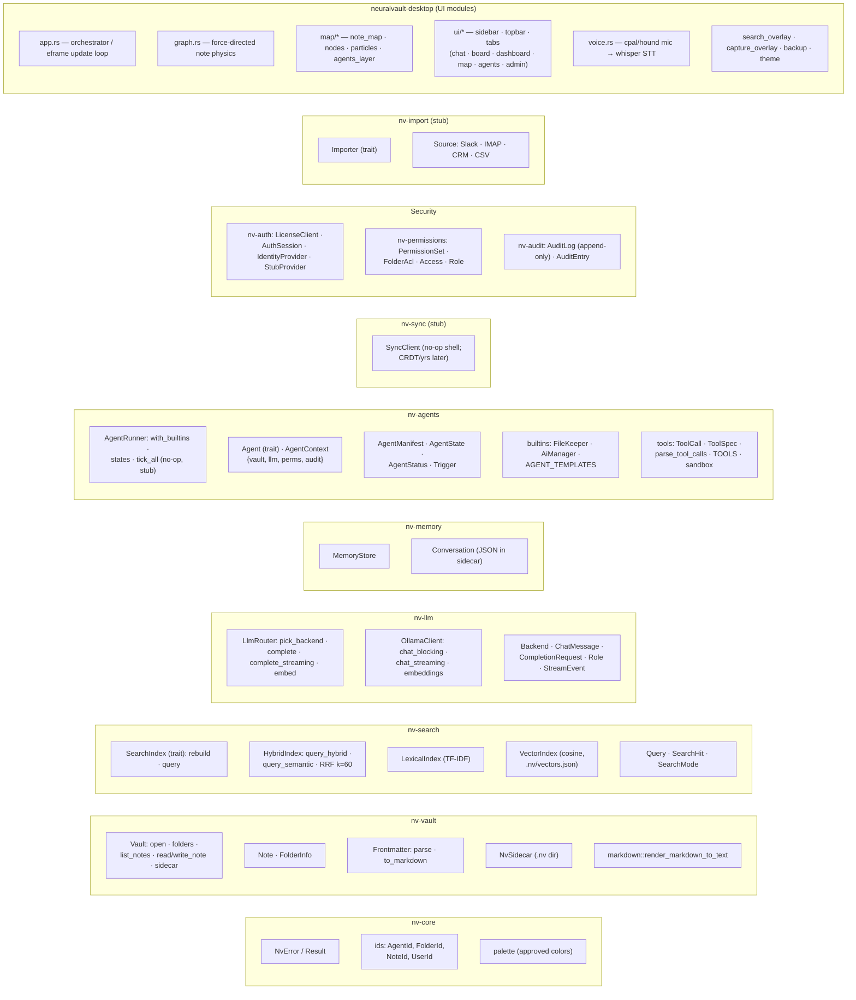
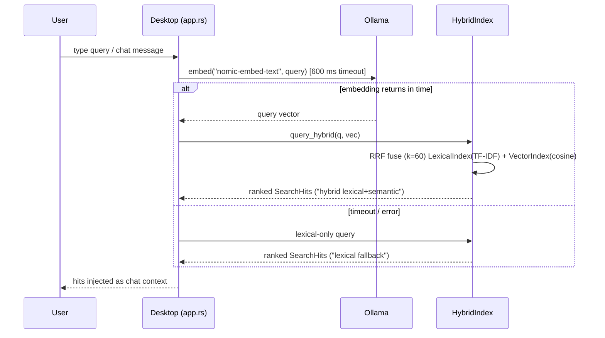
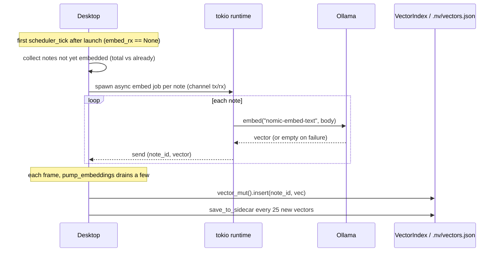
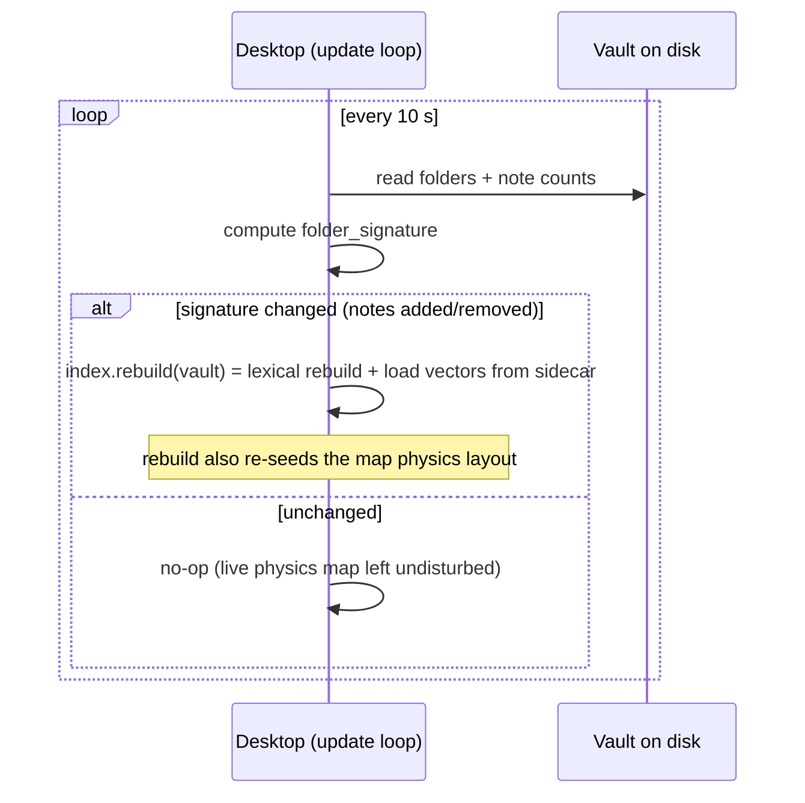
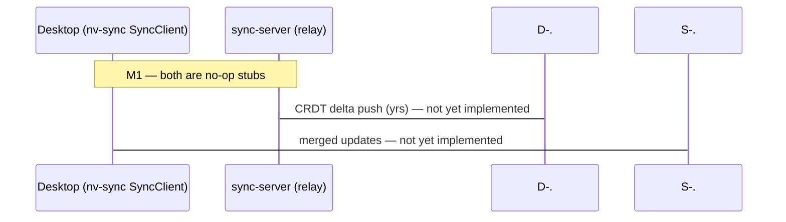

# NeuralVault — Architecture (layered C4)

> Source-of-truth Mermaid diagrams for the interactive HTML beside this file.
> Generated 2026-06-14 from the code at `C:\Users\Futur\Documents\AiWorkspace\NeuralVault`
> (workspace v0.9.0-beta, GitNexus index 9b61a15). **This is an M1 skeleton:** contracts/types
> are frozen and the desktop search/embedding path is fully wired, but several crate bodies are
> deliberate stubs (`nv-sync`, `sync-server`, `AgentRunner::tick_all`, most importers, cloud LLM).
> Stubbed elements are marked `(stub)` and drawn with dashed borders.

Legend: **solid** = wired & running · **dashed** = planned / M1 stub · `→` = depends-on / calls.

---

## L1 — System Context

---

## L2 — Containers (crate dependency graph)

Every edge below is taken directly from each crate's `Cargo.toml`. `nv-core` is the dependency-light
foundation; `nv-agents` is the apex (6 internal deps); the **desktop** binary pulls all 11 crates,
**sync-server** only 4.

---

## L3 — Components (key types per crate)

---

## L4 — Key runtime flows

### (a) Search / RAG — `vault_context_for` (app.rs:2026)

### (b) Embed-at-launch — `scheduler_tick` (app.rs:2474) + `pump_embeddings` (app.rs:2724)

### (c) Re-index on change — 10 s poll (app.rs:3053)

### (d) Multi-device sync — planned (M1 stub)

